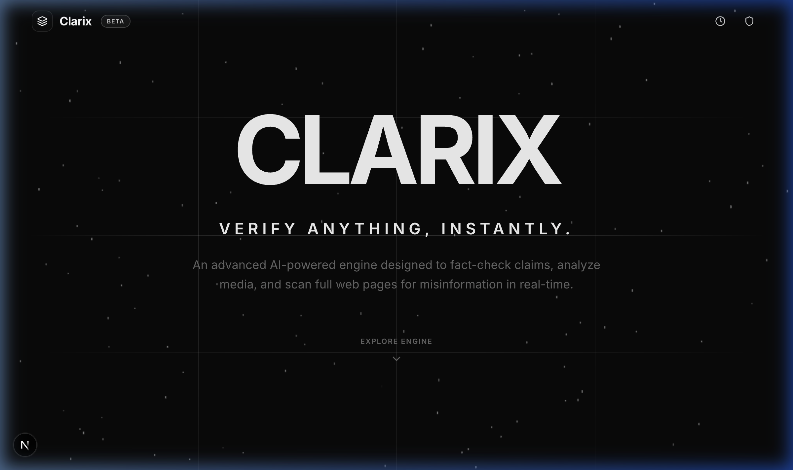
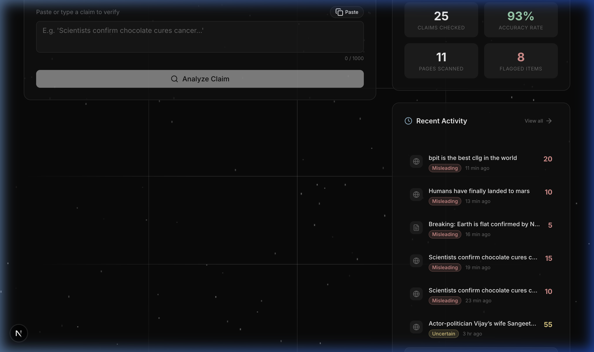
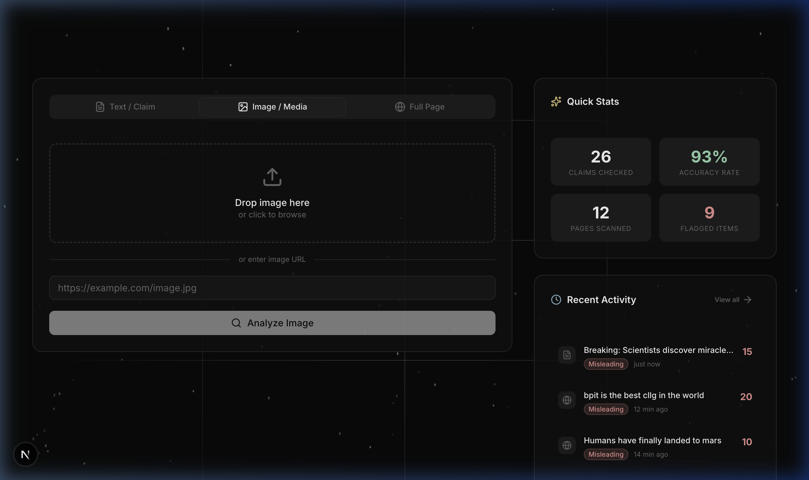
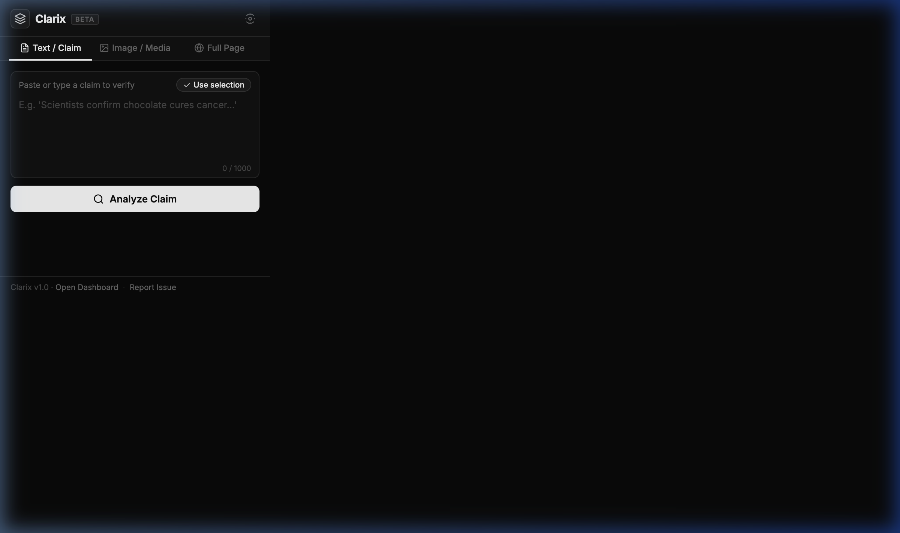
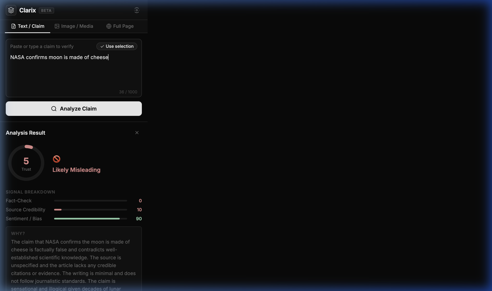

<div align="center">

# 🛡️ CLARIX — Truth Engine

### **Verify Anything, Instantly.**

An advanced AI-powered credibility engine that fact-checks claims, detects deepfake images, analyzes media bias, and scans full web pages for misinformation — in real-time.

[](LICENSE)
[](https://nodejs.org/)
[](https://python.org/)
[](https://nextjs.org/)
[](https://openai.com/)

</div>

---

<div align="center">



</div>

---

## 📋 Table of Contents

- [Overview](#-overview)
- [Key Features](#-key-features)
- [Architecture](#-architecture)
- [Web Dashboard](#-web-dashboard)
- [Browser Extension (USP)](#-browser-extension--our-usp)
- [Tech Stack](#-tech-stack)
- [Getting Started](#-getting-started)
- [API Reference](#-api-reference)
- [Future Scope](#-future-scope--roadmap)
- [Contributing](#-contributing)
- [License](#-license)

---

## 🌟 Overview

**CLARIX** (Credibility, Legitimacy, and Authenticity Recognition & Intelligence eXtended) is an end-to-end misinformation detection platform that combines:

- 🧠 **LLM-powered claim extraction & fact-checking** (GPT-4.1)
- 🤖 **HuggingFace ML model** for fake news classification
- 🖼️ **EfficientNet-B0 deepfake detection** for image authenticity
- 📊 **Multi-signal credibility scoring** (Fact-Check, Source Credibility, Sentiment/Bias)
- 🔌 **Browser extension** for real-time verification while browsing

CLARIX doesn't just flag content as fake — it provides a **detailed trust score (0-100)**, explains *why* content is misleading, and cites reference sources so users can verify independently.

---

## ✨ Key Features

| Feature | Description |
|---|---|
| 📝 **Text/Claim Analysis** | Paste any claim or article text → get instant credibility assessment |
| 🖼️ **Deepfake Detection** | Upload images to detect AI-generated/manipulated media |
| 🌐 **Full Page Scanning** | Enter any URL → CLARIX scrapes and analyzes the entire page |
| 📊 **Trust Score (0-100)** | Multi-dimensional scoring with Fact-Check, Source Credibility, and Bias breakdown |
| 🧩 **Browser Extension** | One-click verification directly in your browser — no tab switching needed |
| 📈 **Live Dashboard** | Real-time stats, analysis history, and activity tracking |
| 🔍 **RAG Pipeline** | Retrieval-Augmented Generation cross-references claims against trusted sources |
| ⚡ **Async Analysis** | Queue-based processing for non-blocking URL analysis |

---

## 🏗️ Architecture

```
┌─────────────────────────────────────────────────────────────────┐
│                        CLARIX Platform                         │
├─────────────────┬──────────────────┬────────────────────────────┤
│                 │                  │                            │
│   Next.js       │   Express.js     │   FastAPI                  │
│   Frontend      │   Backend        │   Python Engine            │
│   (Port 3001)   │   (Port 3000)    │   (Port 8000)              │
│                 │                  │                            │
│  ┌───────────┐  │  ┌────────────┐  │  ┌──────────────────────┐  │
│  │ Dashboard │──┼─▶│ API Server │──┼─▶│ HuggingFace Model    │  │
│  │ Analyzer  │  │  │ LLM Svc    │  │  │ (Fake News Detector) │  │
│  │ Stats     │  │  │ ML Svc     │  │  │                      │  │
│  └───────────┘  │  │ RAG Svc    │  │  │ EfficientNet-B0      │  │
│                 │  │ Caching    │  │  │ (Deepfake Detector)  │  │
│  ┌───────────┐  │  └─────┬──────┘  │  │                      │  │
│  │ Extension │──┼────────┘         │  │ GPT-4.1 Pipeline     │  │
│  │ (Popup)   │  │                  │  │ (Claim Verification) │  │
│  └───────────┘  │  ┌────────────┐  │  └──────────────────────┘  │
│                 │  │ Neon DB    │  │                            │
│                 │  │ (Postgres) │  │                            │
│                 │  └────────────┘  │                            │
└─────────────────┴──────────────────┴────────────────────────────┘
```

---

## 🖥️ Web Dashboard

The CLARIX web dashboard provides a **premium, dark-themed interface** with real-time particle animations and glassmorphism cards.

### Landing Page

<div align="center">


*Sleek landing page with animated particle background and "Verify Anything, Instantly" tagline*

</div>

### Analyzer Dashboard

<div align="center">



*Dashboard with Text/Claim input, Quick Stats (live from database), and Recent Activity feed*

</div>

### Analysis Results

<div align="center">


*Full analysis result showing Trust Score ring (15/100), "Misleading" verdict, Signal Breakdown bars (Fact-Check, Source Credibility, Sentiment/Bias), and detailed AI-generated explanation*

</div>

### Image / Deepfake Detection

<div align="center">



*Image upload with drag-and-drop zone and URL input — powered by EfficientNet-B0 deepfake detection model*

</div>

---

## 🧩 Browser Extension — Our USP

> **The CLARIX Browser Extension is the heart of the platform.** While dashboards are useful, the real power lies in verifying content *while you browse* — without switching tabs, copy-pasting text, or disrupting your workflow.

### Why This Matters

Most fact-checking tools require you to **leave the page**, paste content into a separate website, and wait for results. CLARIX brings the verification engine **directly into your browser toolbar**, making credibility assessment as natural as clicking a bookmark.

### Extension Popup — Clean & Focused

<div align="center">



*Compact popup with three modes: Text/Claim verification, Image/Media analysis, and Full Page scanning*

</div>

### Extension Analysis — Instant Results

<div align="center">



*Real analysis result inside the extension popup — Trust Score of 5, "Likely Misleading" verdict with full Signal Breakdown and AI explanation for the claim "NASA confirms moon is made of cheese"*

</div>

### Extension Features

| Feature | How It Works |
|---|---|
| 📋 **Text Analysis** | Paste or type any claim → instant credibility check |
| ✅ **Use Selection** | Highlight text on any web page → click "Use Selection" → analyze |
| 🖼️ **Image Check** | Upload or paste image URL → deepfake detection |
| 🌐 **Full Page Scan** | Click "Scan Full Page" → CLARIX analyzes the entire page you're on |
| 🔗 **Dashboard Link** | One-click to open the full web dashboard for deeper analysis |

### How to Install the Extension

1. Open `chrome://extensions` (or `brave://extensions` / `edge://extensions`)
2. Enable **Developer Mode** (toggle in top-right)
3. Click **"Load unpacked"**
4. Select the `extension/` folder from this repository
5. Pin the **Clarix** icon in your toolbar

> **Works with:** Chrome, Brave, Edge, and any Chromium-based browser.

---

## 🛠️ Tech Stack

### Frontend
| Technology | Purpose |
|---|---|
| **Next.js 16** (Turbopack) | React framework with server-side rendering |
| **Tailwind CSS** | Utility-first styling |
| **Radix UI** | Accessible component primitives |
| **Framer Motion** | Scroll-reveal and micro-animations |
| **Lucide React** | Icon library |

### Backend (Node.js)
| Technology | Purpose |
|---|---|
| **Express.js** | REST API server |
| **Prisma ORM** | Type-safe database queries |
| **OpenAI SDK** | GPT-4.1 for claim extraction, verification, and summarization |
| **Multer** | Image file upload handling |
| **Bull** | Job queue for async analysis (optional, Redis-backed) |
| **Joi** | Request validation |

### Python Engine
| Technology | Purpose |
|---|---|
| **FastAPI** | High-performance async API |
| **Transformers** | HuggingFace fake news detection model |
| **PyTorch** | Deep learning inference |
| **EfficientNet-B0** | Deepfake image classification |
| **Pydantic** | Schema validation |

### Infrastructure
| Technology | Purpose |
|---|---|
| **Neon** (PostgreSQL) | Serverless database |
| **Supabase** | pgvector for RAG embeddings (optional) |
| **Redis** | Caching & job queues (optional, falls back to in-memory) |

---

## 🚀 Getting Started

### Prerequisites

- **Node.js** ≥ 18
- **Python** ≥ 3.11
- **npm** ≥ 9
- An **OpenAI API Key** ([get one here](https://platform.openai.com/api-keys))

### 1. Clone the Repository

```bash
git clone https://github.com/ParthGupta1304/CLARIX.git
cd CLARIX
```

### 2. Configure Environment Variables

**Server backend** (`server/.env`):
```bash
cp server/.env.example server/.env
# Edit server/.env and add your keys:
#   OPENAI_API_KEY="sk-your-key-here"
#   DATABASE_URL="your-neon-postgres-url"
```

**Python engine** (`.env` in project root):
```bash
# Create .env in project root
OPENAI_API_KEY=sk-your-key-here
OPENAI_MODEL=gpt-4.1-mini
LLM_PROVIDER=openai
HOST=0.0.0.0
PORT=8000
LOG_LEVEL=info
```

### 3. Install Dependencies

```bash
# Node.js backend
cd server && npm install && npx prisma generate && npx prisma db push && cd ..

# Next.js frontend
cd frontend && npm install && cd ..

# Python engine
pip install -r requirements.txt
```

### 4. Start All Services

```bash
# Terminal 1 — Backend API (port 3000)
cd server && npm run dev

# Terminal 2 — Frontend dashboard (port 3001)
cd frontend && PORT=3001 npm run dev

# Terminal 3 — Python AI engine (port 8000)
python main.py
```

### 5. Load the Browser Extension

1. Go to `chrome://extensions`
2. Enable **Developer Mode**
3. Click **Load unpacked** → select the `extension/` folder
4. Pin the Clarix icon 📌

### Quick Verification

```bash
# Health check
curl http://localhost:3000/api/health
# → {"success":true,"status":"healthy"}

# Test analysis
curl -X POST http://localhost:3000/api/analyze \
  -H "Content-Type: application/json" \
  -H "X-API-Key: your-public-api-key" \
  -d '{"type":"text","content":"Scientists confirm chocolate cures cancer"}'
# → {"success":true,"data":{"score":10,"verdict":"Misleading",...}}
```

---

## 📡 API Reference

All endpoints are prefixed with `/api` and served at `http://localhost:3000`.

| Method | Endpoint | Description | Auth |
|---|---|---|---|
| `GET` | `/api/health` | Server health check | No |
| `POST` | `/api/analyze` | Unified analysis (text/image/page) | API Key |
| `POST` | `/api/analyze/url` | Analyze a URL | API Key |
| `POST` | `/api/analyze/text` | Analyze raw text | API Key |
| `POST` | `/api/analyze/image` | Deepfake detection (multipart upload) | API Key |
| `GET` | `/api/analyze/history` | Get analysis history | API Key |
| `GET` | `/api/analyze/:resultId` | Get specific result | No |
| `GET` | `/api/stats` | Dashboard statistics | No |
| `POST` | `/api/analyze/async/url` | Queue async URL analysis | API Key |
| `GET` | `/api/analyze/status/:id` | Poll async job status | No |

### Request Example

```json
POST /api/analyze
Content-Type: application/json
X-API-Key: your-api-key

{
  "type": "text",
  "content": "Breaking: Scientists discover miracle cure for all cancers"
}
```

### Response Example

```json
{
  "success": true,
  "data": {
    "score": 15,
    "verdict": "Misleading",
    "factCheck": 10,
    "sourceCredibility": 20,
    "sentimentBias": 5,
    "explanation": "The article makes an extraordinary claim...",
    "credibility": {
      "score": 15,
      "confidence": 0.9,
      "category": "flagged",
      "label": "Flagged as Fake",
      "badge": "FAKE"
    },
    "sources": [
      { "title": "Reuters Fact Check", "url": "https://www.reuters.com/fact-check/" },
      { "title": "AP News Fact Check", "url": "https://apnews.com/hub/ap-fact-check" }
    ]
  }
}
```

---

## 🔮 Future Scope & Roadmap

CLARIX is built as a modular, extensible platform. Here's what's coming next:

### 🌐 Full Website Scanning
> **Currently:** CLARIX can analyze individual URLs and text.  
> **Next:** Deep-crawl entire websites, analyzing every page for credibility patterns, identifying systemic misinformation across a domain, and generating a site-wide trust report.

### 🐦 X (Twitter) Integration
> **Goal:** Real-time tweet and thread analysis.  
> - Monitor trending topics for misinformation spikes  
> - Analyze tweets with image/video attachments for deepfakes  
> - Generate credibility scores for viral threads  
> - Track misinformation propagation patterns across retweets  

### 🤖 Reddit Analysis
> **Goal:** Subreddit and post-level credibility checks.  
> - Analyze top posts in news subreddits (r/news, r/worldnews, r/politics)  
> - Cross-reference claims in comments with known facts  
> - Flag potential astroturfing and coordinated misinformation  
> - Provide community-level credibility heatmaps  

### 📱 Additional Social Platforms
> Planned integrations for **Instagram**, **Facebook**, **Telegram**, and **YouTube** to verify visual and video content at scale.

### 🧠 Advanced AI Features
| Feature | Description |
|---|---|
| **Video Deepfake Detection** | Extend EfficientNet to analyze video frames for face-swap and lip-sync deepfakes |
| **Multi-language Support** | Support fact-checking in Hindi, Spanish, French, Arabic, and more |
| **Source Network Graph** | Visualize how misinformation spreads across sources using graph databases |
| **Real-time Alerts** | Push notifications for high-confidence misinformation in followed topics |
| **Collaborative Fact-Checking** | Community-driven verification with upvote/downvote on analyses |
| **Custom Watchlists** | Monitor specific topics, people, or sources for new misinformation |

### 📊 Analytics & Reporting
- **Misinformation Trend Dashboard** — Track fake news patterns over time
- **Exportable Reports** — PDF/CSV exports for journalists and researchers
- **API Webhooks** — Real-time notifications for enterprise integrations
- **Media Literacy Score** — Personalized score tracking your fact-checking habits

---

## 📁 Project Structure

```
CLARIX/
├── frontend/                 # Next.js 16 web dashboard
│   ├── src/app/page.tsx      # Main dashboard page
│   └── src/components/       # UI components (shadcn/ui)
│
├── server/                   # Express.js backend
│   ├── src/
│   │   ├── config/           # Environment config
│   │   ├── controllers/      # Route handlers
│   │   ├── services/         # Business logic
│   │   │   ├── llm.service.js          # OpenAI GPT integration
│   │   │   ├── ml.service.js           # Python engine bridge
│   │   │   ├── credibility.service.js  # Scoring pipeline
│   │   │   └── rag.service.js          # RAG retrieval
│   │   ├── routes/           # API routes
│   │   └── middleware/       # Auth, rate-limiting
│   └── prisma/schema.prisma # Database schema
│
├── extension/                # Chrome extension (popup + content scripts)
│   ├── popup.html            # Extension popup UI
│   ├── popup.js              # Popup logic & API calls
│   ├── popup.css             # Extension styles
│   └── manifest.json         # Extension manifest (MV3)
│
├── engine/                   # Python AI modules
│   ├── pipeline.py           # Main verification pipeline
│   ├── claim_extractor.py    # Claim extraction
│   ├── claim_verifier.py     # Fact verification
│   ├── deepfake_detector.py  # EfficientNet-B0 deepfake model
│   ├── bias_analyzer.py      # Bias detection
│   └── scorer.py             # Credibility scoring
│
├── image_model/              # Pre-trained model weights
│   └── deepfake_model.pth    # EfficientNet-B0 weights
│
├── main.py                   # FastAPI entry point
├── config.py                 # Python engine config
└── requirements.txt          # Python dependencies
```

---

## 🤝 Contributing

Contributions are welcome! Here's how to get started:

1. **Fork** this repository
2. Create a feature branch: `git checkout -b feature/your-feature`
3. Commit your changes: `git commit -m "feat: add your feature"`
4. Push to the branch: `git push origin feature/your-feature`
5. Open a **Pull Request**

Please follow the existing code style and include tests where applicable.

---

## 📄 License

This project is licensed under the MIT License — see the [LICENSE](LICENSE) file for details.

---

<div align="center">

**Built with ❤️ by [Parth Gupta](https://github.com/ParthGupta1304)**

*Fighting misinformation, one claim at a time.*

</div>
